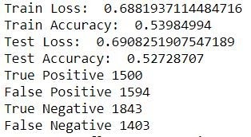

#### By: Alec Domotor, Kyle Lindteigen, Yogesh Raparia, Jaya Sai Veepuru

## Introduction/Background

A couple of our team members are fans of the NBA and are interested in the idea of sports analytics. We as a group also wanted to create something that could potentially financially benefit us and from the combination of those two came our idea to look into different ways of beating the betting odds for NBA games.

## Problem Definition

We would like to find a way to correctly predict the outcome of NBA games, and specifically we would like to create a model that will determine the odds of a team beating the betting spread on those games. More broadly we would also like to look into finding ways to group good teams and bad ones using their statistical seasonal averages.

## Data Collection

There are three sources we got our data for this project from. The first is basketball reference which will give us the seasonal statistics of each team per 100 possessions. The reason the per 100 possessions is important is because it factors out the pace that a team plays at which can skew a teams per game averages. Some factors in this dataset include field goal percentage, 3 point percentage, assists, turnovers, points, etc. We also include the data on the opponents per 100 possession stats with the same factors that are included in the teams per 100 stats. The reason we decided to include this is because the statistics involving defense are not sufficient enough to capture how good a teams defense is so including the rates against opponents should fill this gap a bit. Finally we have some advanced statistical data that is usually derived from the other factors in some way. These include things like offensive efficiency, true shooting percentage, effective field goal percentage, etc. As for data cleaning we ended up normalizing all of the teams seasonal statistics per season. 

The second source we use is GoldSheet which has per game plus minus odds going back all the way to 1994 which gives us a lot of data to work with. The important factor in this data set is the plus minus but it also includes the results of the games which is what we would be looking to predict. The third data set comes from sports book reviews online which has the betting odds for a team winning or losing. In order to clean these data sets we simply combine them to include the three factors that we are looking to use and then we also want to include the season statistics that we mentioned in our first dataset.

For the feature selection, since this is the midterm report and we have not quite finished tinkering with what works well with our project we ended up using most of the factors from the first source mentioned in our unsupervised learning model. Some factors that are included in our data sets that we don’t think we will need are games played, minutes played, stadium, age of players, and similar data that doesn’t have much to do with on the court performance. We also tried different groupings of the factors with our unsupervised model. When we get to our supervised learning we will need to think more about the data we include because some of the factors are not independent, for example field goal percentage and true shooting percentage are not independent of one another.

## Methods

### Unsupervised learning:

For unsupervised learning, we would want to cluster the teams or players that are likely to perform better and win similar to this article [James]. For this we would like to use GMM, as it will provide probability for each team, which is likely to go to playoffs or likely to perform better. We could also use K-means for unsupervised learning. But as K-means is a hard classifier, it might not be helpful while placing bets or looking for odds. Also, we would like to use hierarchical clustering to observe which teams and players come under an umbrella and how the model performs differently than K-means.

For our initial GMM studies, we looked at a group of traditional basketball statistics including field goals, three pointers, two pointers, free throws, rebounds, assists, steals, blocks, turnovers, fouls, and points.  We first tried considering each season’s stats for each team as a datapoint and clustering the teams from all seasons.  Then we looked at isolated seasons and only clustered the teams within that season.  After clustering the teams, we calculated the average wins for each cluster as a rough indicator of the predictive power of our clusters.

### Supervised Learning:

We noticed that Neural Networks is the most commonly used algorithm for sports betting and we would like to go in the same direction as was used in this article [Hubáček & Sourek & Železný]. As NN is the last topic in the class course, we want to explore other methods in the meantime. As our problem statement revolves around the odds or probability of a team winning (classification type), we would like to use SVM, Logistic Regression, or Naive Bayes approaches. Out of these approaches, we would like to use Logistic Regression as it will use the probability or Odds while classifying the output. Also, Naive Bayes approaches uses the probability of a team winning under the circumstances of events (x1, x2, x3...). So, we would like to use these two methods and compare the outputs. SVM is a hard classifier, so it might be very helpful for our case.

## Unsupervised Learning Results

For our initial studies with GMM unsupervised learning, we looked at traditional basketball statistics for each team, including shots and shot percentages, points, rebounds, steals, turnovers, etc. If we considered each team for one season as a data point and clustered the teams, we found that more modern teams were placed in the same cluster and older teams were also grouped together in the same cluster, even though year was not a feature of the dataset. This indicates that trends in these statistics must be evolving over time, and we will need to look at each season individually in order to make meaningful predictions.  

When we isolated a single season and clustered the teams, we found that there were typically a few clusters with similar average wins, with one cluster standing out with significantly lower average wins. This could be a useful predictive metric for identifying teams we do not expect to perform well.  

We then tried to do some unsupervised learning using the advanced statistics in our table. The first model we created with this data was a K-means. In order to identify the ideal number of clusters we used elbow method to identify a good number of clusters to use. We identified that the ideal number of clusters should be 6 using the elbow method and then fitted a model with using 6 clusters. We then used the same parameters to then get a GMM model. For both of these we wanted to look at the average number of wins in each cluster to see if teams are being grouped well. In both the K-means and GMM model we saw similar results where there is typically one cluster that had about 25 wins on average then 2 of them with about a 37 and 39 win average. The final three clusters had about a 45 to 55 win average. This tells us that we were somewhat successful in grouping the better teams together and the worse teams together. Also looking at the teams that were in the highest average win group we saw that a good portion were playoff teams which means that they were the better teams in that season which also lets us know the groupings worked.

Next we used the same data and took means of these attributes for all the year for every team and repeated the same process for fitting and prediction. The reason we decided to do this was to see how teams compare over the years. We identified that the optimum number of clusters were 4 with this approach. With this approach as probably should have been expected the average number of wins per cluster was closer together around the mid 30s to low 40s. This just means that there were some notable teams that stayed consistently good over the years and some that did not.

For our midterm report we did not end up getting to our supervised learning model but that will be our focus for the rest of the semester.
### Supervised Learning Results:

### Neural Networks Model 

The first approach we used is Residual Neural Networks. We trained the model on 171 features, for home and away teams, to predict the result as yes if it meets points spread and no if it doesn’t meet the points spread. 

### Data Preparation: 

The data is randomly split into 70% for training and 30% for testing purposes. As our total data set has 21,133 data points, it resulted in 14793 data points for training purpose and 6340 points for testing purpose. 

#### Model: 

We trained the model using a residual neural network model. Initially we used neurons as 32 and layers as 3. The result that we got is: 

Train and test accuracy seemed to be very close and we believe it is a good model. 

The hyper parameters that we used for this model are number of neurons and number of layers. To find the best set of hyper parameters, we ran the entire model for different inputs of neurons ranging [16,32,48,64,80,96,112,128] and for each neuron, the layers ranging from 2 to 7. The best test accuracy we have found is for the set of hyperparameters – (Neuron, Layer) - (112,4). The complete results that we got for different sets of hyperparameters is shown below: 
 
 
Next, to find how the model has changed to different set of neurons and layers, we plotted the below graphs: 

For each variable in Neuron, we took the average of that variable for all layers and its performance against training accuracy and test accuracy. 
 
From the above graph, we noticed that as number of neurons increased, the training accuracy has increased 
 
But we noticed that with increase in number of neurons, the test accuracy has increased and decreased, forming a bell-shaped curve. The maximum test accuracy is when neurons are 64. 

For each variable in Layers, we took the average of that variable for all Neurons and its performance against training accuracy and test accuracy. 
 
We noticed that as the number of layers increase, the test accuracy increases, formed a peak shaped curve and then decreased. The maximum test accuracy we got is when layers are 4. 
 
But we noticed a different behavior for train accuracy and number of layers. With increase in number of layers, the training accuracy has decreased. We think the high accuracy at with less number of layers might be because of over-fitting. 

### Supervised Learning – Random Forest Classifier

One approach we tested for supervised learning was a random forest classifier model.  Given the input dataset, which contained 115 features of basketball statistics for the home and away teams, the model would attempt to predict a True/False value representing whether or not the home team would cover the betting point spread for the game. 

#### Data Preparation

The full dataset was divided into a test set and an out-of-sample set by pulling 25% of the datapoints at random (without replacement) and setting them aside in a new dataset, to be used as an out-of-sample set.  The remaining 75% of the datapoints would be used to train the random forest model.  Since our original dataset contained 21,129 datapoints, this resulted in a train set of 15,847 datapoints and an out-of-sample test set of 5,282 datapoints. 

#### Training the Model

To start, a random forest classifier was fit to the in-sample test set, with 50 estimator trees and no other restrictions on fitting, i.e. the trees would continue splitting all the way to perfect purity, and all features were considered at every split.  Then, this model was used to predict the outcome of all datapoints in both the train set and the out-of-sample set.  As might be expected, this resulted in a tremendous in-sample accuracy (the accuracy is the fraction of correct predictions out of the total number of datapoints in the set).  However, the out-of-sample accuracy was no better than a random guess, which we would expect to yield 50% accuracy.  Clear signs of overfitting!
 
To combat over-fitting, we need to make the model more generalized.  One method to do this is to limit the depth of the trees in the random forest, so that they stop splitting at a maximum depth rather than splitting all the way to perfect purity.  Keeping the number of trees at 50, the max depth of each tree was varied between 1 and 20, with the following results:

Clearly, the in-sample accuracy improves as the max depth of the trees increases, but the out-of-sample accuracy suffers when the max depth becomes too large.  If we zoom in on only the out-of-sample accuracy, we get the following plot:

The out-of-sample accuracy seems to peak when the max depth is somewhere near the range of 3-7, then falls off as the max depth increases.  So, the random forest model was constrained to a max depth of 5.  At the peak, we are achieving accuracies of around 53%, so we are already doing better than a random guess!
We can also edit the number of trees in the random forest.  Holding the max depth at 5, the number of estimator trees was varied between 1 and 100, yielding the following result:

The number of estimator trees does not seem to have a significant impact on out-of-sample accuracy, although the peak might be somewhere between 50 and 80, from visual inspection.  For in-sample accuracy, we see that there is a dramatic improvement in accuracy up to about 40 trees, then the accuracy starts to level off.  Therefore, a n_estimators value of 60 seems appropriate moving forward.

We can also try varying the percentage of features used at each split in the trees to reduce over-fitting.  Holding the number of trees at 60 and the max depth of the trees at 5, the fraction of features used was varied between 5% and 100%.  The results are shown below:

Again, varying the fraction of features used does not seem to have a dramatic effect on out-of-sample accuracy, but a subtle peak around 80% might exist.  Therefore, we will constrain our model to only using 80% of features at each split (the features are randomly selected without replacement at each split).

Finally, another method to reduce over-fitting is to constrain the minimum number of samples contained in each leaf node of the trees.  This would eliminate splits which only isolate a few datapoints, which might be outliers and not very useful for a generalized model.  Keeping the number of trees at 60, the max depth at 5, and the max features at 80%, varying the min samples per leaf yields the following results:

Constraining the minimum samples per leaf seems to help somewhat for out-of-sample accuracy, peaking at around 350 min samples per leaf. 
So, our final parameters for the random forest classifier are as follows: a forest of 60 trees, limited to a max depth per tree of 5 and a minimum of 350 samples per leaf node, using a random selection of 80% of the features at each split.  After fitting a model with these parameters and testing it both in and out of sample, we see that our in-sample accuracy is much worse than the original, unconstrained random forest model, but our out-of-sample accuracy is now above 54%, which is much better than a random guess.  Also, the in- and out-of-sample accuracies are much closer to each other, which is desirable.

An example of one of the trees generated in the forest is shown here (make link to image).

If we look at the 50 greatest feature importances given by the model, we get the following plot:

We can see that the Net Rating for both the home and away teams (designated as “Home_NRtg” and “Away_NRtg”) rank high in importance, with the home team’s net rating being the most important feature in the model.  This conceptually makes sense because those stats are meant to be an overall estimate of a team’s point differential per 100 possessions, and point differential will be directly related to covering a spread.  The point spread itself also ranks high in importance, which indicates that the betting lines set by sports books may not be perfectly efficient, and a particularly high or low spread might be a useful predictor in the model. 

#### Application to Betting – Kelly Criterion

To use our random forest model for actually betting on games, we can utilize the Kelly Criterion.  The Kelly Criterion gives the optimal percentage of a bettor’s bankroll he or she should bet on each game, given the odds of success and the payout if successful.  The formula is as follows:

Where p is the chance of success, q is the chance of failure (which equals 1-p), b is the payout if successful, and f* is the optimal fraction of bankroll to bet.  Given that our model was approximately 54% successful out-of-sample, and a successful bet will yield a 100% return on our bet, our optimal leverage is as follows:

Which indicates that we should bet about 8% of our bankroll on every game using this model.  However, a common practice is to use Half Kelly leverage, to build in a margin of safety in case our model does not perform exactly as expected in the real world.  So, an optimal strategy might be to bet 4% on each game.  For example, if we started with a balance of $10,000 and wanted to grow our money by betting on NBA point spreads, we would bet $400 on each game according to our model’s predictions, and update the value of our bet as our bankroll increases or decreases. 

#### Backtesting the Strategy

We will test two strategies:

1. Starting with $10,000, we will pull a game from the out-of-sample dataset at random and bet 4% of our bankroll on the predicted outcome from our random forest model.  If we are correct, our bankroll increases by the amount we wagered, and if we are incorrect, we lose our wager.  Continue picking games at random and updating the bankroll for 500 iterations.

2. Starting with $10,000 we will pull a game from the out-of-sample dataset at random and bet 4% of our bankroll on a random True/False value (a coin flip).  If we are correct, our bankroll increases by the amount we wagered, and if we are incorrect, we lose our wager.  Continue picking games at random and updating the bankroll for 500 iterations.
After running the backtest as described, we arrive at the following result:

Definitely a promising result!  The coin-flip strategy does not earn any money, finishing the 500 games slightly in the red, at around $9,200.  However, our random forest strategy grows the bankroll to about $150,000!  Before we go out and open an account at our local sports book, however, we should note some limitations of this study.  Perhaps most importantly, our “out-of-sample” dataset became somewhat in-sample, because we already tested the model on it and knew that the accuracy would be around 54%.  Obviously, if you have 54% odds in a game of chance that pays out 1-to-1, you are going to make a lot of money.  Also, our dataset had some look-ahead bias because we used the current season’s stats to predict the outcome of games in that season.  Although all of the stats are normalized per 100 possessions, there may be some positive correlation where teams with better stats beat more point spreads that season, and vice versa.  Also, the strategy assumes you are only betting on one game at a time, so even if you bet on a game every day during a season, it would take several years to realize these kinds of returns.  Still, the model definitely shows some promise for future refinement and testing!

## Discussion

This project has a number of potential difficulties the first of which would be dealing with the data and the uncertain nature of sports betting as is talked about in the Charles Malafosse article. Sports are an area that is difficult to predict due to dealing with all of the variables that contribute to the success of a team and there are certain unpredictable aspects such as players getting injured. Not only is it hard to predict but the people creating these betting spreads usually use all the tools at their disposal to create even odds for both sides leaving it more difficult for us to predict one side or the other. Even with this all being the case this project could be very profitable for us should we succeed in creating a good model. 

#### [Link to download project proposal video](https://raw.githubusercontent.com/kylelindteigen/CS7641_Project/gh-pages/ProjectProposalVid.mp4)

#### [Link to download project final video](https://raw.githubusercontent.com/kylelindteigen/CS7641_Project/gh-pages/final.mp4)

## References:

Malafosse, Charles. “Machine Learning for Sports Betting: Not a Basic Classification Problem.” Medium, Towards Data Science, 11 Oct. 2019, [https://towardsdatascience.com/machine-learning-for-sports-betting-not-a-basic-classification-problem-b42ae4900782](https://towardsdatascience.com/machine-learning-for-sports-betting-not-a-basic-classification-problem-b42ae4900782). 

Hubáček, Ondřej & Sourek, Gustav & Železný, Filip. (2019). Exploiting sports-betting market using machine learning. International Journal of Forecasting. 35. 10.1016/j.ijforecast.2019.01.001. 

James. "Clustering NBA Playstyles Using Machine Learning" Medium, Towards Data Science, 26 Oct. 2019,
[https://towardsdatascience.com/clustering-nba-playstyles-using-machine-learning-8c7e8e23c90c](https://towardsdatascience.com/clustering-nba-playstyles-using-machine-learning-8c7e8e23c90c).

Basketball Statistics and History. (n.d.). Retrieved November 06, 2020, from [https://www.basketball-reference.com/](https://www.basketball-reference.com/).

GoldSheet. (n.d.). Retrieved November 06, 2020, from [http://www.goldsheet.com/histnba.php](http://www.goldsheet.com/histnba.php).

SPORTSBOOK REVIEWS. (n.d.). Retrieved November 06, 2020, from [https://www.sportsbookreviewsonline.com/scoresoddsarchives/nba/nbaoddsarchives.htm](https://www.sportsbookreviewsonline.com/scoresoddsarchives/nba/nbaoddsarchives.htm).

